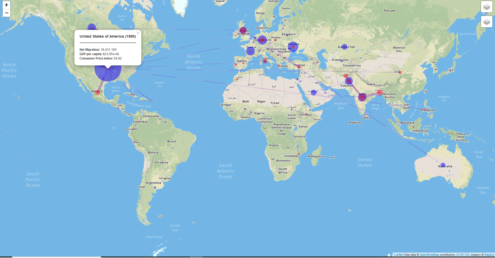

# Immigration-data-visualization

Use immigration data from World Bank and United Nations to visualize migrant flows over time.

Python to extract data from file, transform data into usable format, and load into PANDAS dataframe.

Using Leaflet mapping to create global map and visualize 

Deploy project on Heroku

Based on visualization below.
http://metrocosm.com/global-migration-map.html
